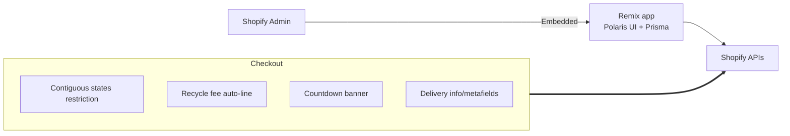

Our Embedded App is a Remix‑based Shopify application that centralizes admin UX, data, and a suite of checkout extensions for compliance and conversion. It ships with Polaris UI, Prisma session storage, and multiple UI Extensions that run natively in Shopify Checkout.

### Timeline & stewardship
- Started: 2024‑06‑11 · GA build complete: 2024‑09 · Maintenance: ongoing
- Engineering: Gabe (Gabriel) Nuñez (initial workflows), Yong Wan Song, Daniel Carroll (feature delivery/checkout logic)
- DevOps/Infra: Junkuk (Mason) Kim (environments, deploys, observability)

### What this app is
- **Embedded admin app** giving merchants centralized controls (Polaris UI) for settings, feature flags, and extension configuration.
- **Checkout extensions suite** that executes in Shopify’s secure runtime to enforce policy at point‑of‑purchase without slowing the storefront.
- **Operational glue** that persists signals (e.g., order attributes) and responds to webhooks with least privilege.

### Why it matters to the business
- **Compliance at checkout**: contiguous‑states restriction and recycling‑fee logic prevent invalid shipments and ensure state fees are included when required—reducing fines, failed deliveries, and tickets.
- **Conversion & AOV lift**: configurable countdown/banner and delivery metadata reduce friction and abandonment; fee automation prevents post‑checkout reversals.
- **Operational efficiency**: order attributes (e.g., Pickup Requested) flow downstream to WAPI/Logistics; admin UI removes manual toggles in theme code; webhooks clean up sessions on uninstall.
- **Platform safety**: runs with Shopify‑issued session and fine‑grained scopes; no secrets in client; all environment variables injected server‑side only.

### Stack
- Remix + Vite (Node ≥16)
- `@shopify/shopify-app-remix` for auth, webhooks, session
- Polaris for admin UI
- Prisma (session storage via `PrismaSessionStorage`)
- App/Checkout UI Extensions (React runtime)

```1:21:c:/Zinus/Zinus/ZinusEmbeddedApp/app/shopify.server.js
const shopify = shopifyApp({
  apiKey: process.env.SHOPIFY_API_KEY,
  apiSecretKey: process.env.SHOPIFY_API_SECRET || "",
  apiVersion: ApiVersion.April24,
  scopes: process.env.SCOPES?.split(","),
  sessionStorage: new PrismaSessionStorage(prisma),
  webhooks: { APP_UNINSTALLED: { deliveryMethod: DeliveryMethod.Http, callbackUrl: "/webhooks" } },
  hooks: { afterAuth: async ({ session }) => { shopify.registerWebhooks({ session }); } },
});
```

### Architecture



### Security posture
- No hard‑coded secrets in the repo; environment variables (e.g., `SHOPIFY_API_KEY`, `SHOPIFY_API_SECRET`, `SCOPES`, `SHOPIFY_APP_URL`) are read at runtime.
- Webhooks validate via the framework’s adapter; session data stored via Prisma‑backed storage.
- Extensions read product data via GraphQL using the authenticated context, avoiding browser‑exposed access tokens.

### Checkout extensions

1) Contiguous states restriction
   - Blocks the buyer journey if the address is a non-contiguous US location

```12:21:c:/Zinus/Zinus/ZinusEmbeddedApp/extensions/contiguous-states-restriction/src/Checkout.jsx
useBuyerJourneyIntercept(() => {
  return shippingAddress?.provinceCode && restrictedLocations.includes(shippingAddress?.provinceCode)
    ? { behavior: 'block', reason: 'We currently do not ship to your location.', errors: [{ message: 'We ship to the 48 contiguous states...', target: '$.cart.deliveryGroups[0].deliveryAddress.provinceCode' }] }
    : { behavior: 'allow' };
});
```

2) Recycling fee automation
   - Detects mattresses/box-springs and auto-syncs the correct fee variant per state

```34:58:c:/Zinus/Zinus/ZinusEmbeddedApp/extensions/recycle-fee/src/Checkout.jsx
function checkForRecycleFee() {
  const provinceCode = shippingAddress?.provinceCode;
  if (feeLocations.includes(provinceCode)) {
    // match fee variant for province, reconcile quantity vs. cart contents
    if (feeInCart && feeInCart.merchandise.selectedOptions[0].value !== provinceCode) {
      handleRemoveFromCart(feeInCart.id, feeInCart.quantity);
      handleAddToCart(feeId, feeInCart.quantity);
    }
    if (feeNeeded > feeFound) { handleAddToCart(feeId, difference); }
  } else { /* remove any fee lines */ }
}
```

3) Checkout countdown banner
   - Configurable content via extension settings; shows time remaining

```12:26:c:/Zinus/Zinus/ZinusEmbeddedApp/extensions/zinus-checkout-countdown/src/Checkout.jsx
const [timeLeft, setTimeLeft] = useState(600);
useEffect(() => { if (!timeLeft) return; const id = setInterval(() => setTimeLeft(timeLeft - 1), 1000); return () => clearInterval(id); }, [timeLeft]);
```

4) Delivery/misc checkout enrichments
   - Reads product metafields and surfaces data in checkout context

```27:41:c:/Zinus/Zinus/ZinusEmbeddedApp/extensions/zinus-checkout-delivery/src/Checkout.jsx
const productId = cartLineTarget?.merchandise?.product?.id;
query(`query { product(id: "${productId}") { variants(first: 25) { edges { node { metafield(namespace: "custom", key: "mattress_height") { value } } } } } }`) ...
```

### Operational notes
- Use `login`/`authenticate` helpers exclusively for embedded navigation and API calls
- Keep `ApiVersion` aligned with current Admin API; update `restResources` accordingly
- Prisma session DB must be shared across instances (SQLite only OK for single instance)
- Extensions should fail “closed” (block or remove lines) to protect compliance

### Business outcomes (selected)
- Fewer invalid orders to non‑contiguous states; decreased shipping exceptions.
- Higher completion rate on regulated carts (fees pre‑added) and fewer post‑purchase adjustments.
- Faster merchant ops via UI‑based configuration instead of code edits.

### Why this matters
By pairing an embedded admin app with checkout-native extensions, we deliver merchant control and strict checkout enforcement without slowing down the storefront. Compliance flows (like recycling fees and shipping restrictions) run client-side within Shopify’s secure runtime; data-heavy or cross-system tasks stay server-side in the app.


