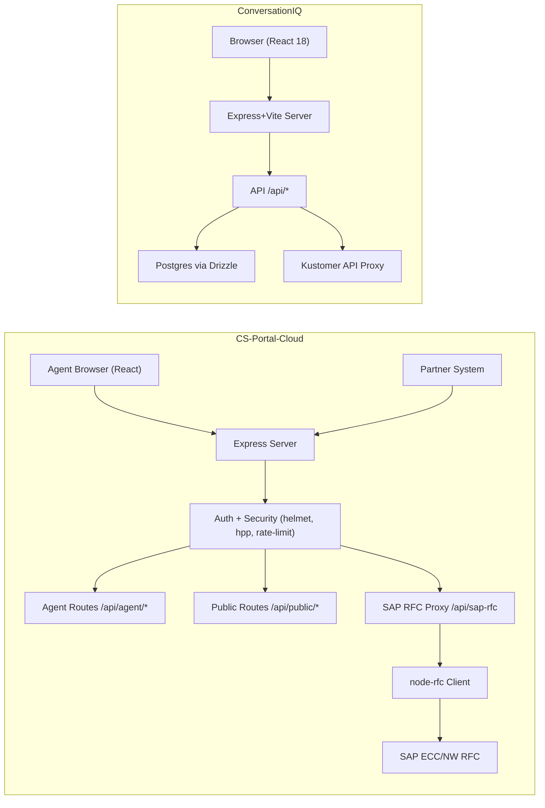

### What is CS‑Portal‑Cloud?
- **Purpose**: A secure customer‑service portal that lets authenticated agents find orders, edit customer info, cancel or refund orders, and check inventory by calling SAP RFCs safely from Node.js.
- **Public API**: Exposes a throttled, API‑key‑protected tracking status endpoint for partner systems.
- **Companion app (ConversationIQ)**: A separate analytics UI + API to ingest, store, and analyze conversation data, including a CORS‑safe Kustomer proxy.

### Why it matters
- **Agent efficiency**: One place to search orders, initiate refunds/cancels, and view logistics.
- **Operational safety**: Server‑side SAP access via `node-rfc`, strict rate‑limits, API keys, and fine‑grained permissions.
- **Partner integration**: Public tracking API removes swivel‑chair work without exposing internal systems.
- **Analytics**: ConversationIQ provides storage and endpoints for quality and CSAT insights.

### Tech stack at a glance
- **Backend (CS‑Portal‑Cloud)**: Node.js, Express, `helmet`, `hpp`, `express-rate-limit`, `cookie-session`, Passport (Auth0 + JWT), `node-rfc` for SAP NW RFC.
- **Frontend (CS‑Portal client)**: CRA (React 16), React‑Bootstrap, Axios.
- **Public API**: API key via `x-api-key` or query; 60 rpm limiter.
- **ConversationIQ**: Express + Vite, Drizzle ORM (PostgreSQL), Zod, React 18 UI, Kustomer proxy.

### Project timeline & ownership
- **Sep 2021 → Dec 2021**: Initial development completed; developed by Gabe (Gabriel) Nuñez.
- **Jan 2022 → Sep 2025**: Continuous enhancements and maintenance by Junkuk (Mason) Kim.
- **Oct 2025 →**: Planned integration of ConversationIQ and other in‑house AI applications into CS‑Portal; team: Junkuk (Mason) Kim and Joshua Cortez (Zinus US Sales).

### High‑level architecture


### Security model (CS‑Portal)
- **Transport**: Typically behind Nginx/443; Node listens on internal HTTP (e.g., 1818). Helmet + HPP enabled.
- **Sessions/Tokens**: `cookie-session` for Auth0 callback; Passport Auth0 populates user; JWT strategy reads `z-auth-token` header or `req.session.jwt`.
- **Authorization**: Route‑level `requirePermission('...')` checks against `user.permissions`, with `UNLIMITED_POWER` escape hatch.
- **Throttling**: Global limiter (1000/15m) for app; 60 rpm for public tracking endpoint.
- **Public API**: `x-api-key` or `api_key` query must match `PUBLIC_API_KEY`.

### SAP integration
- **Library**: `node-rfc` `Client` with DEV/PRD targets. On connect → invoke RFC → optionally pick `outputKey` → close connection.
- **RFCs used** (non‑exhaustive):
  - `ZSD1_CS_WEB_ORD_LST` (order list)
  - `ZSD1_CS_WEB_POST` (refund posting)
  - `ZSD1_CS_WEB_ADDR_CHG` (address change)
  - `ZSD1_CS_WEB_AVAIL_STOCK_PLANT` (inventory by SKU)
  - `ZSD1_CS_WEB_ORD_CANCEL` (order cancellation)
  - `ZSD1_CS_WEB_TRACKING_STAT` (public tracking status)

### Request flows
<div class="mermaid">
sequenceDiagram
  participant UI as Agent UI (React)
  participant API as Express /api/agent
  participant SAPP as Express /api/sap-rfc
  participant RFC as node-rfc Client
  participant SAP as SAP (DEV/PRD)

  UI->>API: GET /api/agent/get-orders?orderNumber=...&vkorg=2000
  API->>SAPP: POST /api/sap-rfc { functionName: ZSD1_CS_WEB_ORD_LST }
  SAPP->>RFC: connect()
  RFC->>SAP: invoke(ZSD1_CS_WEB_ORD_LST, params)
  SAP-->>RFC: T_ORDER
  RFC-->>SAPP: result
  SAPP-->>API: T_ORDER (trimmed)
  API-->>UI: 200 JSON array of orders
</div>

<div class="mermaid">
sequenceDiagram
  participant PS as Partner System
  participant PUB as Express /api/public/tracking-status
  participant RFC2 as node-rfc Client
  participant SAP2 as SAP (DEV/PRD)

  PS->>PUB: GET ?IV_VKORG=2000&IV_CUST_PO=... + x-api-key
  PUB-->>PS: 401 if key invalid
  PUB->>RFC2: connect + invoke(ZSD1_CS_WEB_TRACKING_STAT)
  RFC2->>SAP2: RFC call
  SAP2-->>RFC2: result
  RFC2-->>PUB: JSON
  PUB-->>PS: 200 JSON (tracking events)
</div>

### CS‑Portal agent endpoints (selected)
- `GET /api/agent/get-orders`: Find orders by customer PO, with optional replacements, `vkorg` (2000/2020).
- `POST /api/agent/refund-order`: Post FI document for refund.
- `POST /api/agent/edit-customer-information`: Update address/contact fields.
- `GET /api/agent/inventory/:sku`: Inventory by SKU across plants.
- `POST /api/agent/cancel-order`: Cancel sales order with reason codes.

### AI Chatbot order tracking (via public API)
- **Purpose**: When a customer asks the AI Chatbot for delivery progress, the bot calls our CS‑Portal public endpoint, which invokes an SAP RFC in real time and returns normalized tracking events.
- **Endpoint**: `GET /api/public/tracking-status`
- **Auth**: API key required
  - Header: `x-api-key: <PUBLIC_API_KEY>`
  - Or query: `?api_key=<PUBLIC_API_KEY>`
- **Rate limit**: 60 requests/min/IP
- **Environment**: `dev=true` targets SAP DEV for testing; omit in production.

- **Parameters**
  - **IV_VKORG | vkorg**: Sales Org. Default is `2000` (Zinus). Example: `2000`, `2020` (Mellow).
  - **IV_CUST_PO | cust_po**: Customer PO (the website “Order Number” customers know and provide to the bot).
  - **dev** (optional): `true` to route to SAP DEV.

- **Response (key fields)**
  - `EV_SUBRC`, `EV_MESSAGE`: SAP return code/message
  - `ET_TRACKING_STAT[]`: array of shipment events with fields such as:
    - `BSTNK` (Customer PO), `VBELN` (SO), `VBELN_VL` (Delivery),
    - `TRACKINGNUMBER`, `ZCODE` (status code), `ZDESC` (status),
    - `ZTRACKING_DATE` (YYYYMMDD), `ZTRACKING_TIME` (HHmmss)

```json
{
  "EV_MESSAGE": "",
  "EV_SUBRC": 0,
  "IV_CUST_PO": "347759",
  "IV_VKORG": "2000",
  "ET_TRACKING_STAT": [
    {
      "BSTNK": "347759",
      "VBELN": "1002966847",
      "VBELN_VL": "8007917472",
      "TRACKINGNUMBER": "283915107408",
      "ZNUM": "01",
      "ZCODE": "OC",
      "ZDESC": "Shipment information sent to carrier",
      "ZTRACKING_DATE": "20250102",
      "ZTRACKING_TIME": "062200"
    }
  ]
}
```

- **Chatbot call examples**
```bash
curl -G "https://cs.zinus.com/api/public/tracking-status" \
  -H "x-api-key: <PUBLIC_API_KEY>" \
  --data-urlencode "IV_VKORG=2000" \
  --data-urlencode "IV_CUST_PO=347759"
```
```bash
# DEV testing
curl "https://cs.zinus.com/api/public/tracking-status?vkorg=2000&cust_po=347759&api_key=<PUBLIC_API_KEY>&dev=true"
```

- **AI Chatbot flow**
<div class="mermaid">
sequenceDiagram
  participant Customer
  participant Bot as AI Chatbot
  participant API as CS Portal Public API
  participant RFC as node-rfc Client
  participant SAP as SAP (DEV/PRD)

  Customer->>Bot: "Where is my order? Order #347759"
  Bot->>API: GET /api/public/tracking-status?vkorg=2000&cust_po=347759 (+ x-api-key)
  API->>RFC: connect()
  RFC->>SAP: invoke ZSD1_CS_WEB_TRACKING_STAT
  SAP-->>RFC: ET_TRACKING_STAT events
  RFC-->>API: normalized JSON
  API-->>Bot: 200 OK (events)
  Bot-->>Customer: Human-readable timeline + tracking link
</div>

- **Contract (suggested type)**
```ts
// Returned payload shape (representative)
export type TrackingStatusResponse = {
  EV_MESSAGE: string;
  EV_SUBRC: number; // 0 = OK
  IV_CUST_PO: string;
  IV_VKORG: string;
  ET_TRACKING_STAT: Array<{
    BSTNK: string;        // Customer PO
    VBELN?: string;       // Sales order
    VBELN_VL?: string;    // Delivery
    TRACKINGNUMBER?: string;
    ZNUM?: string;        // sequence number
    ZCODE?: string;       // status code
    ZDESC?: string;       // description from SAP/carrier mapping
    ZTRACKING_DATE?: string; // YYYYMMDD
    ZTRACKING_TIME?: string; // HHmmss
  }>;
};
```

- **Normalization in the bot**
  - Compose an ISO timestamp: `iso = ZTRACKING_DATE + ZTRACKING_TIME` → parse to Date and localize for the customer.
  - Sort ascending by timestamp to build the delivery timeline.
  - Use `ZDESC` when present; otherwise derive a friendly label from `ZCODE` (see mapping template below).
  - If multiple shipments exist, group by `TRACKINGNUMBER` and render separate timelines.

- **Status mapping template (configure per market/carrier)**
  - **OC**: Label created / Shipment info sent to carrier
  - **IT**: In transit (hub → hub)
  - **OD**: Out for delivery
  - **DL**: Delivered
  - **EX**: Exception (address issue, weather, etc.)
  - Fallback: Use `ZDESC` as provided

- **Customer‑visible state model**
<div class="mermaid">
stateDiagram-v2
  [*] --> Created
  Created --> InTransit
  InTransit --> OutForDelivery
  OutForDelivery --> Delivered
  InTransit --> Exception
  OutForDelivery --> Exception
  Exception --> InTransit: Resolved/Reattempt
  Delivered --> [*]
</div>

- **Error handling & resiliency**
  - **400** missing params: Ask customer to re‑enter order number; validate digits/format.
  - **401** invalid API key: Do not reveal details; log internally, show generic failure.
  - **429** rate limit: Backoff and retry after 5–15s; consider short‑term cache.
  - **5xx** upstream/system: Return last known event if available, with “We’re checking with the carrier.”
  - Timeouts: Cap end‑to‑end call at ~8–10s; show a helpful fallback message.

- **Caching & freshness**
  - Live queries preferred; for repeated questions within a session, cache per `IV_CUST_PO` for 15–30s.
  - Never cache beyond a few minutes; tracking updates are time‑sensitive.

- **Security & keys**
  - Store `PUBLIC_API_KEY` in the bot’s secrets store; never expose to browsers.
  - Rotate keys on request and monitor 401/429 spikes.
  - Do not log full tracking numbers in error logs; hash or redact.

- **Observability**
  - Log: request id, vkorg, hashed cust_po, latency, status code, and result size (count of events).
  - Emit alerts on elevated EV_SUBRC or persistent 5xx from SAP.

### CS‑Portal client highlights
- React‑Bootstrap UI; order search with business selector radios (`vkorg`: 2000 Zinus, 2020 Mellow).
- Modular action modals: Cancel, Refund, Edit Customer Info, Reverse.
- Axios to agent endpoints; inline loading and success/error feedback.

### ConversationIQ overview
- Express API on port 5000; Vite in dev, static serve in prod.
- Endpoints: list/get/save/delete conversations; batch analysis stub; analytics stats.
- Kustomer proxy: `GET /api/kustomer/conversations` accepts `Authorization: Bearer <API_KEY>` and forwards with CORS safety.
- Storage: Drizzle `conversations` table: `{ id, analysis_json, created_at }`.

<div class="mermaid">
flowchart LR
  UIQ[React UI] --> APIQ[Express API]
  APIQ --> DBQ[(Postgres / Drizzle)]
  APIQ --> KQ[Kustomer API Proxy]
  subgraph Storage
    DBQ
  end
</div>

### Operational notes
- Use a stable Node.js LTS (e.g., 18.x) to build native modules like `node-rfc`.
- Ensure SAP NW RFC SDK libraries are installed and exported (e.g., `LD_LIBRARY_PATH`), and service unit files persist env vars.
- For HTTPS, terminate TLS at Nginx (443) and forward to Node HTTP; align client `baseURL`/protocols accordingly.

If you want deeper dives (e.g., exact RFC payload structures, permission matrix, or CI/CD layout), I can extend this post with code excerpts and sequence charts per module.
